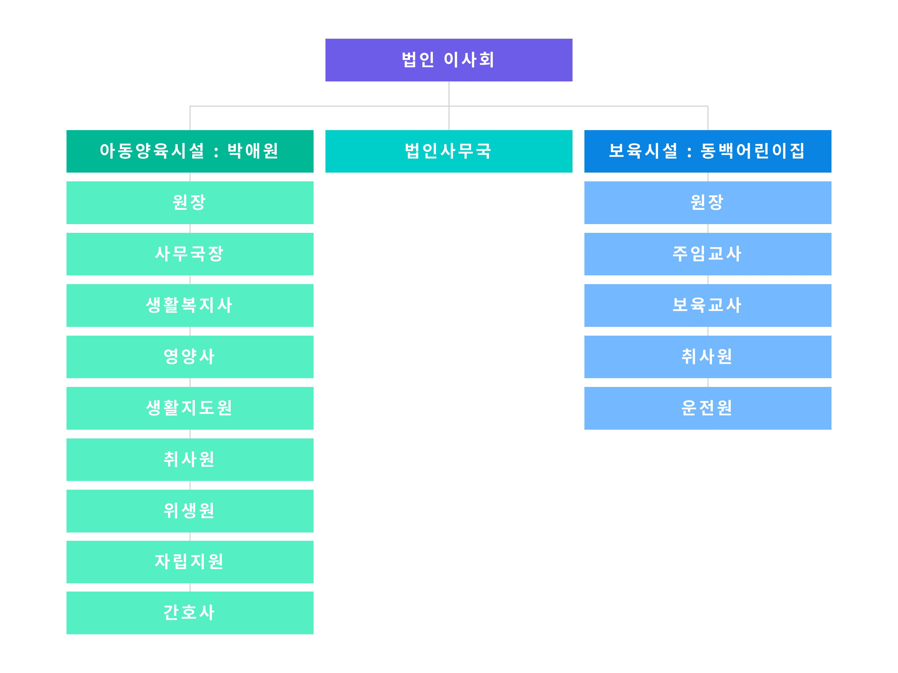

## 설립목적

사회복지사업법 제2조 제1항, 아동복지법 제16조 제1항 제1호에 의한 사업을
수행함으로써 사회복지 증진에 이바지함을 목적으로 하여 가정문화, 아동복지를
이념으로 사회복지사업 수행과 전문직 사회복지서비스를 제공하여 아동들에게 각종
사회문제를 예방하고 자아실현의 여건과 청소년들에게는 꿈과 희망과 자신감을
심어주고 소외감을 덜어 줄 수 있도록 설립되어진 사회복지시설 박애원입니다.

## 기구표

## 연혁

날짜 | 내용
:-: | :--
1956.05.26 | 고아 등 25명으로 육아시설 박애원 설립(초대원장 임온전)
1962.02.28 | 재단법인 박애원인가(이사장 윤석종)
1971.10.24 | 사회복지법인 변경허가 윤석종 초대 대표이사 취임
1979.11.17 | 동부산 공업고등기술학교 문교부 정식인가
1993.10.13 | 해운대공업고등학교 설립 후 공립으로 전환하여 국가에 기부
1996.01.16 | 아동보육시설 동백어린이집 설치

## 아동양육시설 박애원 아동현황

구분 | 미취학 | 초등부 | 중등부 | 고등부 | 기타 | 계
:-: | :-: | :-: | :-: | :-: | :-: | :-:
남 | 17 | 4 | 5 | 8 | - | 34
여 | 5 | 3 | 1 | 4 | - | 13
계 | 22 | 7 | 6 | 12 | - | 47

## 동백어린이집 아동현황

(현원, 연령 만 기준)

계 | 0세 | 1세 | 2세 | 3세 | 4세 | 5세
:-: | :-: | :-: | :-: | :-: | :-: | :-:
108 | - | - | 28 | 15 | 30 | 35

## 기본재산 현황

### 목적사업용 기본재산

구분 | 소재지 | 규모(㎡)
:-: | :-: | :-:
토지 | 부산광역시 해운대구 해운대로 469번길 76 | 8,539
건물 | 부산광역시 해운대구 해운대로 469번길 76 | 4,237.76

### 수익사업용 기본재산

구분 | 소재지 | 규모(㎡)
:-: | :-: | :-:
토지 | 부산광역시 동구 중앙대로 371번길 42 | 311.10
건물 | 부산광역시 동구 중앙대로 371번길 42 | 810.01
